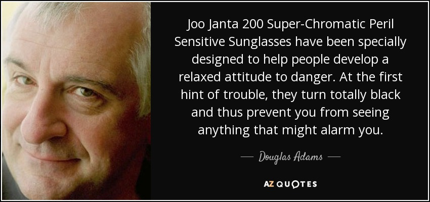

# Programming Standards

## Table of Contents
- [General Strategies](#general-strategies)
- [Folder Expectations](#folder-expectations)
- [Documentation standards](#documentation-standards)
- [Merge Requests](#merge-requests)
- [Branch Naming Convention](#branch-naming-convention)
    - [For Features](#for-features)
    - [For Bugfix](#for-bugfix)
    - [For Refactor](#for-refactor)
- [Programming naming conventions](#programming-naming-conventions)
    - [Classes](#classes)
    - [Methods](#methods)
    - [Variables](#variables)
    - [Constants](#constants)
    - [Final Notes](#final-notes)
- [Important note](#important-note)

## General Strategies

Branches
- one feature/fix per branch
- branch often

Push Commits often
- Your own branch is yours to break

[Pull Request Strategy](./PullRequestStrategy.md)

Have Fun!

And when in danger remember this!

## Folder Expectations

### Client Side Source code 
- goes in `./client-side`

Tests
- goes in `./client-side/test`

Integration Tests
- goes in `./client-side/integration_test`

Server Side Source code
- goes in `./server-side`

**decide testing based on java frameworks**

## Documentation standards

Please note the intended flow in a markdown file under the same directory as the source code.

## Merge Requests

Make the title relevant to the change

When creating the merge request please make a change log of what changes you had made.
This could be in list form.

## Branch Naming Convention

When making future branches please follow one of the standards that matches
for example
`spr$(num)/branch`
would be for sprint 1
`spr1/branch`

### For Features
- `spr$(num)-feature/some-descriptive-title`

### For Bugfix
- `spr$(num)-bugfix/some-descriptive-title`

### For Refactor
- `spr$(num)-refactor/some-descriptive-title`

## Programming naming conventions

### Classes
- Please UpperCamelCase 
- Capitalize the first letter of each word
- Examples: `MyManager` or `MyLife`

### Methods
- Use camelCase
- first word lowercase every subsequent word first letter is capitalized
- Examples: `getLot`, `getMySanity`, `getAnswerToLifeUniverseEverything` 
- Please ensure the name is descriptive.

### Variables
- Use camelCase
- first word lowercase every subsequent word first letter is capitalized
- Examples: `lotId`, `spaceNumber` 
- Please ensure the name is descriptive.
- Ensure variables are declared at start of method or file

### Constants
- Use SCREAMING_SNAKE_CASE
- all letters are capitalized and spaces are underscores
- Example: `WHY_ARE_YOU_YELLIING`, `THE_DOCS_TOLD_ME_TO`

### Final Notes
- Try to keep name length semi reasonable.

## Important note
- Please have fun!
